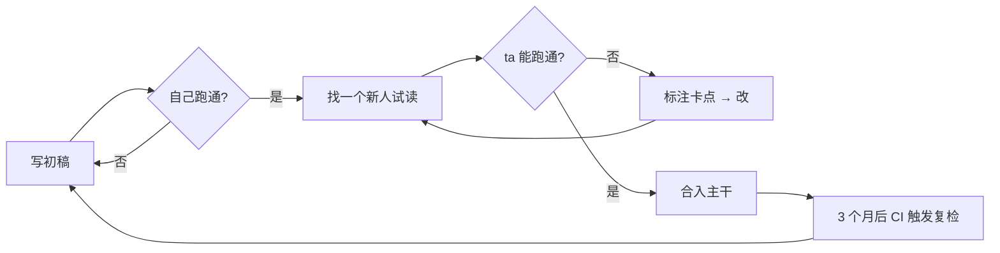

# 复杂文档：从「写完」到「能用」

让你的文档真的被人读、被人用、被人改——而不是仓库角落里一份永远过期的 README。

副标题：一份关于「文档工程化」的完整指南 · v2.0

作者：王某 / 李某 / 张某 · 2026.06 · 内部分享

---

## 议程

1. **为什么文档总是没人看**
   - 写作者视角的三个误判
   - 读者视角的三个痛点
2. **三个核心原则**
   - 以读者为中心
   - 场景化
   - 可执行
3. **好文档 vs 坏文档**:从两段真实样本对比开始
4. **一段最小示例胜过千言**
   - Shell / Python / Go / TypeScript 四语对照
   - 何时该写完整示例,何时该写片段
5. **三个常见误区**(以及如何规避)
6. **工具与流程**
   - [ ] 工具选型
   - [ ] 写作流程
   - [ ] 评审与迭代
7. 小结、Q&A、Thanks

---

# Part 1 · 为什么文档总是没人看

> 写代码是给机器看的,写文档是给六个月后的自己看的。
>
> —— 某个被自己旧代码坑过的人

## 一组扎心数据

| 指标 | 数值 | 备注 |
|:---|---:|:---|
| 工程师认为「应该」写文档的比例 | **92%** | 来自 2025 年内部问卷 |
| 实际「持续」写文档的比例 | 17% | 周更新 ≥ 1 次 |
| 文档在 6 个月后仍然准确的比例 | 23% | 抽样 120 份 README |
| 新人能仅凭文档跑通的比例 | 11% | 不问任何人 |
| 每年因文档缺失导致的重复提问 | ~3,400 次 | 仅一个 200 人团队 |

**结论一句话:大家都知道该写,但没人真的在维护。**

## 三个核心原则

- **以读者为中心**:先想"谁会读、带着什么问题读",再决定写什么。
  - 新人:需要 5 分钟跑起来
  - 同事:需要 30 秒查到字段
  - 自己(6 个月后):需要 1 分钟想起来为什么这么设计
- **场景化**:用一个具体场景代替三段抽象描述。
- **可执行**:每段话读完,读者应该知道下一步做什么。


*图 1:好文档的三原则形成一个闭环。*

## 原则一深入:以读者为中心

许多技术写作者的第一反应是「把自己知道的全部写下来」,这恰恰是文档失败的最大原因。读者并不是带着「我想全面学习这个系统」的心态打开文档的——他们多半是被一个**具体问题**驱动而来:服务起不来、字段不知道填什么、接口返回了一个看不懂的错误码。

如果你的文档第一屏写的是「项目背景」「设计哲学」「架构演进史」,那么 80% 的读者会在 10 秒内关掉它。一个反直觉但有效的写法是:**把读者最可能搜的关键词,放在最显眼的位置**——比如错误信息、命令名、字段名。让搜索引擎和 Ctrl+F 替你完成第一道分发。

> 💡 一个判断标准:把你的文档目录贴给一个从没接触过这个项目的同事,问 ta "你大概能从哪一节找到 X",如果 ta 答不出来,目录就该重写。

# Part 2 · 实战:把原则落到笔下

## 好文档 vs 坏文档

**坏文档的样子**

- 列了 API 字段,却不说怎么调用
- 说"请参考下文",却不给跳转链接
- 大段抽象描述,没有一个例子
- 代码示例缺依赖、缺导入、缺上下文,贴上就报错
- 更新时间停留在 2 年前,而代码已经 rewrite 过两次

**好文档的样子**

- 给一个最小可运行的代码示例(MRE, Minimal Reproducible Example)
- 引用精准到行号,能点击跳转 (`auth.py:42`)
- 用具体场景说明"什么时候用、什么时候别用"
- 错误信息原文出现在文档里,方便搜索
- 标注「最后验证日期」,过期会触发 CI 警告

## 一段最小示例胜过千言

文档里最该出现的,是这种「贴上就能跑」的代码:

```bash
# 最朴素的 cURL,所有人都能验证
curl -X POST https://api.example.com/v1/users \
  -H "Authorization: Bearer $TOKEN" \
  -H "Content-Type: application/json" \
  -d '{"name":"Alice","email":"alice@example.com","role":"admin"}'
```

读者把 `$TOKEN` 替换成自己的就能验证——比十段"如何认证"的描述都管用。

## 四语对照:同一件事的四种写法

```python
# Python — requests
import os, requests

resp = requests.post(
    "https://api.example.com/v1/users",
    headers={"Authorization": f"Bearer {os.environ['TOKEN']}"},
    json={"name": "Alice", "email": "alice@example.com", "role": "admin"},
    timeout=10,
)
resp.raise_for_status()
print(resp.json()["id"])
```

```go
// Go — net/http
package main

import (
    "bytes"
    "encoding/json"
    "fmt"
    "net/http"
    "os"
)

func main() {
    body, _ := json.Marshal(map[string]string{
        "name":  "Alice",
        "email": "alice@example.com",
        "role":  "admin",
    })
    req, _ := http.NewRequest("POST", "https://api.example.com/v1/users", bytes.NewReader(body))
    req.Header.Set("Authorization", "Bearer "+os.Getenv("TOKEN"))
    req.Header.Set("Content-Type", "application/json")
    resp, err := http.DefaultClient.Do(req)
    if err != nil { panic(err) }
    defer resp.Body.Close()
    fmt.Println(resp.Status)
}
```

```typescript
// TypeScript — fetch
const resp = await fetch("https://api.example.com/v1/users", {
  method: "POST",
  headers: {
    "Authorization": `Bearer ${process.env.TOKEN}`,
    "Content-Type": "application/json",
  },
  body: JSON.stringify({ name: "Alice", email: "alice@example.com", role: "admin" }),
});
if (!resp.ok) throw new Error(`HTTP ${resp.status}`);
const { id } = await resp.json();
console.log(id);
```

行内代码示意:执行前请确保 `TOKEN` 已设置,可用 `echo $TOKEN | head -c 8` 校验前 8 位字符。

## 写作工作流(Mermaid)




*图 2:文档不是写完就完事,而是「写 → 用 → 反馈 → 改」的循环。*

## 现场调研:办公桌的真实文档

下面这张照片是某团队的真实现场——堆满未读资料、笔记和便利贴。


## 团队文档现状(三视角)


*图 3:三种「文档」共存——纸质归档、临时白板、数字仓库。问题是它们从不互相同步。*

# Part 3 · 误区与边界情况

## 三个常见误区

> [!WARNING]
> **追求完整性**:试图覆盖所有边界情况,结果谁都没耐心看完。先发布 60 分版本,再根据反馈补到 80 分。

> [!CAUTION]
> **只更新代码不更新文档**:6 个月后文档已经全是骗人的。建议把文档检查接入 CI——比如检查所有代码片段是否仍能编译。

> [!WARNING]
> **闭门造车**:写完不让任何人试读就上线,结果新人看了一头雾水。**找一个 ta 是目标读者的人**试读,记录 ta 卡住的每一处。

## 各类提示框语义(Alert 全集)

> [!NOTE]
> 普通说明性信息。例如:本节内容假设你已熟悉 HTTP 基础概念。

> [!TIP]
> 锦上添花的小建议。例如:VS Code 安装 `Markdown All in One` 插件可以一键格式化表格。

> [!IMPORTANT]
> 重要但不紧急。例如:文档的元信息(作者、日期、版本)请始终保留在文件顶部。

> [!WARNING]
> 容易踩坑的地方。例如:`$TOKEN` 永远不要直接提交到 git 仓库,即使是私有仓库。

> [!CAUTION]
> 严重后果警告。例如:在 production 环境运行下面的 `DELETE` 语句前,请务必先在 staging 验证。

## 工具对比(扩展版)

挑工具的优先级:**能用就好,别让选型本身成为不写文档的借口。**

| 工具         | 适合场景               | 学习成本 | 协作 | 版本化 | 离线 | 开源 | 月费(团队 10 人) |
|:-----------|:-------------------|:---:|:---:|:---:|:---:|:---:|------------:|
| Markdown   | 任何项目,跟代码一起版本化      | 低   | ★★  | ★★★★★ | ✅  | ✅  |          $0 |
| Notion     | 团队协作、内部知识库         | 中   | ★★★★★ | ★★  | ❌  | ❌  |        $100 |
| Confluence | 企业级、需要审批流          | 中   | ★★★★ | ★★  | ❌  | ❌  |         $55 |
| GitBook    | 对外的产品文档            | 中   | ★★★ | ★★★★ | 部分 | 部分 |         $80 |
| Docusaurus | 大型开源项目站点           | 高   | ★★  | ★★★★★ | ✅  | ✅  |          $0 |
| MkDocs     | Python 项目、轻量 site | 低   | ★★  | ★★★★★ | ✅  | ✅  |          $0 |
| Obsidian   | 个人知识库、双向链接         | 中   | ★   | ★★★★ | ✅  | 部分 | $0(个人免费) |


*图 4:四款常见文档工具。挑一个开始,比纠结哪个最好更重要。*

## 文档工程的演进时间线

- **2010** 之前 · README.txt + Word 文档,版本随邮件附件流转
- **2010–2015** · GitHub Wiki / Confluence 兴起,文档进入「网页化」
- **2015–2020** · Markdown 一统江湖,docs-as-code 成为共识
- **2020–2024** · 静态站点生成器(Docusaurus / VitePress)+ 自动部署
- **2024–2026** · **AI 辅助写作 + 文档即测试**:LLM 校对、CI 验证示例可运行
- **2026 →** · 文档与代码双向生成:从测试用例反推 API 文档,从注释生成教程

## 嵌套结构压力测试

> 这是一段引用,里面会出现一个列表:
>
> 1. 第一项,带 `行内代码`
> 2. 第二项,带 [外链](https://example.com)
> 3. 第三项,里面再嵌一个代码块:
>
>    ```js
>    console.log("引用 → 列表 → 代码块,三层嵌套");
>    ```
>
> 以及一段加粗 + *斜体* + ~~删除线~~ 的文本。

列表里嵌表格:

- 第一项:文字说明
- 第二项:一个迷你表格

  | k | v |
  |:--|:--|
  | a | 1 |
  | b | 2 |

- 第三项:继续文字

## HTML 内联元素

按下 <kbd>Ctrl</kbd> + <kbd>K</kbd> 可以唤起搜索;按 <kbd>Esc</kbd> 关闭。

化学式示例:H<sub>2</sub>O、CO<sub>2</sub>、E = mc<sup>2</sup>。

<mark>这段是高亮强调的内容</mark>,用来标记复审时需要关注的重点。

<details>
<summary>点击展开:完整的错误码列表(默认折叠)</summary>

- `4001` — Token 缺失
- `4002` — Token 过期
- `4003` — 权限不足
- `5001` — 上游服务不可用

</details>

## 数学与公式

文档读者留存率的简化模型:

$$ R(t) = R_0 \cdot e^{-\lambda t} + \beta \cdot U(t) $$

其中 $R_0$ 是初始留存,$\lambda$ 是衰减系数,$U(t)$ 是更新强度,$\beta$ 是更新对留存的提振系数。

行内公式:$\lambda \approx 0.04$/周(即 6 个月后只剩约 38% 的内容仍然有效)。

## 边界与压力情况

**超长不可断 URL**:`https://docs.example.com/very/deeply/nested/path/to/some/resource/with/a/extremely-long-segment-name-that-never-breaks-on-spaces-or-hyphens?query=foo&another=bar&yet=baz`

**超长中文不带标点的一整句**:文档之所以重要不仅仅是因为它能让其他人理解你正在做的事情更重要的是它强迫你自己把那些原本只是模糊地存在于脑海里的想法用清晰具体且可被他人验证的语言重新组织一遍这个过程本身就会暴露出原先被你忽略的设计缺陷

**特殊字符与转义**:`<script>`、`&amp;`、`{{ template }}`、` ``` `(三反引号)、`|表格|分隔|` 在段落里、emoji 🚀🎨🐛✨ 与文字 baseline 对齐。

**极短内容**:

# 一

## 单行标题没有正文

# Part 4 · 收束

## 小结

> [!IMPORTANT]
> 文档不是"写完就完事"的一次性产物,而是和代码一样需要**持续维护、迭代、贴近用户**——开始写、坚持改、让人真的用上,比一开始就选对工具重要得多。

**三句话带走:**

1. 先写 60 分,别追求 100 分
2. 找真实读者验证,不要自己写自己读
3. 把文档检查接入 CI,让陈旧的内容自己冒出来

## Q & A

留 5 分钟交流,欢迎挑战以下任意一点:

- 「我们项目就是写不出文档,根本没人有时间」
- 「AI 能不能直接生成文档,人不用管?」
- 「内部文档和对外文档应该用同一套工具吗?」

## Thanks

开始写 · 坚持改 · 让人用

—— 王某 / 李某 / 张某 · 2026.06
